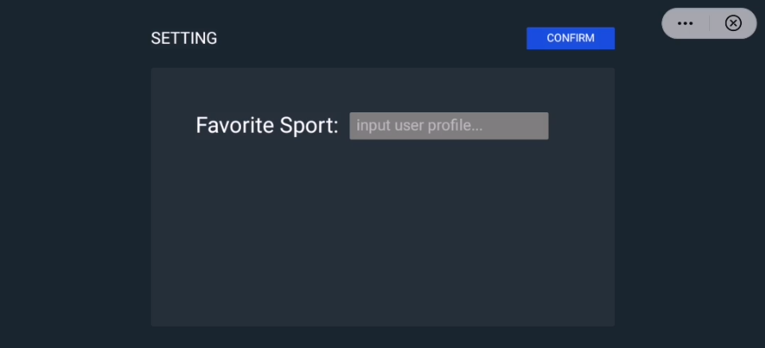

# Analytics Kit Demo for Quick Games

## Contents

* [Introduction](#Introduction)
* [Getting Started](#Getting-Started)
* [Installation](#Installation)
* [Configuration](#Configuration)
* [Environment Requirements](#Environment-Requirements)
* [Sample Code](#Sample-Code)
* [License](#License)

## Introduction

HmsAnalyticsKitDemo provides an example of integrating Analytics Kit into a quick game. It illustrates how to collect predefined events and custom events to improve user engagement and user preference.
[Learn more about Analytics Kit](https://developer.huawei.com/consumer/en/doc/development/HMSCore-Guides/introduction-0000001050745149).

## Getting Started

For details, please refer to the links below:

[Development Guide](https://developer.huawei.com/consumer/en/doc/development/HMSCore-Guides/introduction-0000001050745149)

[API Reference](https://developer.huawei.com/consumer/en/doc/development/HMSCore-References/overview-0000001077819400)

HmsAnalyticsKitDemo demonstrates how to use the Analytics SDK for quick games.

1. Download HmsAnalyticsKitDemo by cloning this repository or downloading the compressed package. 

2. Open Cocos Dashboard, import the project, and configure the project development environment.

    1. On the **Editor** page, download Cocos Creator of the required version.

    2. On the **Project** page, click **Add** and select the required HmsAnalyticsKitDemo project.

    3. Open the imported project.

    4. Go to **File** > **Settings...** and set **Data Editor** and **Native Develop**.

        1. On the **Data Editor** page, set **External Script Editor** to the path of Visual Studio Code.

        2. On the **Native Develop** page, set **NDK Root** to the NDK path.

        3. On the **Native Develop** page, set **Android SDK Root** to the path of the Android SDK.

3. Download the Analytics SDK and import it to **assets/Lib**.

    1. Import the SDK file, which is named [hmscore-analytics-sdk-quickgame-*xx.xx.xx*.esm.js](https://developer.huawei.com/consumer/en/doc/development/HMSCore-Library/quickapp-sdk-download-0000001090739375). In the **Set as a plug-in** dialog box displayed, select **Yes**.

    2. Import the AppGallery Connect file on which the Analytics SDK depends, which is named [agconnect-quickgame-*xx.xx.xx*-min.js](https://developer.huawei.com/consumer/cn/doc/development/AppGallery-connect-Library/agc-auth-quickgame-sdkdownload-0000001182308451). In the **Set as a plug-in** dialog box displayed, select **Yes**.

4. Build and run the project.

    1. Start HUAWEI Quick App IDE, create a project, and click **compilation** to debug the project. During the debug, install Huawei Quick App Loader on your phone, and then go back to Cocos Dashboard.

    2. Go to **Project** > **Build...**.

    3. In the **Build...** dialog box displayed, set **Platform** to **Huawei Quick Game** and click **Build**. After the build is complete, click **Play**.

    4. In the **QuickGame Devtools** dialog box displayed, click ▶ to run the project.

    5. (Optional) Go to the **OUTPUT** panel of HUAWEI Quick App IDE to view the log information.

Apart from the preceding operations, you need to create an app in AppGallery Connect, obtain the **agconnect-services.json** file, and assign the JSON data in the file to the **aGConnectServicesConfig** variable in the **Analytics.js** file. Click [here](https://developer.huawei.com/consumer/en/doc/development/HMSCore-Guides/introduction-0000001050745149) to learn more about the development process.

## Installation

Use HUAWEI Quick Game IDE to open the compressed project, which contains two demos:
   1. **hmsanalyticskitdemo**: demo that has integrated the Analytics SDK.
   2. **hmsanalyticskitdemo-start**: demo that has not integrated the Analytics SDK. You can use this demo to try to integrate the Analytics SDK.

## Configuration

Create an app in AppGallery Connect, obtain the project configuration, and add the project configuration to your quick game project.

## Environment Requirements

Hardware:

1. A computer (desktop or laptop)
2. An Android mobile phone

Software:

1. [Cocos Dashboard](https://www.cocos.com/en/creator/download)
2. [Visual Studio Code](https://code.visualstudio.com/), whose path is required when you configure **External Script Editor** in Cocos Dashboard
3. [Android SDK](https://www.androiddevtools.cn/), whose path is required when you configure **Android SDK Root** in Cocos Dashboard
4. [NDK](https://developer.android.google.cn/ndk/downloads), whose path is required when you configure **NDK Root** in Cocos Dashboard
5. [HUAWEI Quick App IDE](https://developer.huawei.com/consumer/en/quickApp-ide/), which is used to install [Huawei Quick App Loader](https://developer.huawei.com/consumer/en/doc/development/quickApp-Guides/quickapp-installtool-0000001126543467) on the mobile phone
6. Sample code used in the codelab
7. Terminal/Console

## Sample Code

After running the demo app, you will see the following screen.

Tap **True** or **False** to answer the question, and tap **POST SCORE** to record your score. All information will be uploaded to the console of Analytics Kit. You can view the information in real time.

Tap **SETTINGS**, and you will see the following screen.

On the screen displayed, you can set your favorite sport. Your configuration will be recorded in the Analytics SDK as a user attribute.

## License

HmsAnalyticsKitDemo is licensed under [Apache License 2.0](http://www.apache.org/licenses/LICENSE-2.0).
